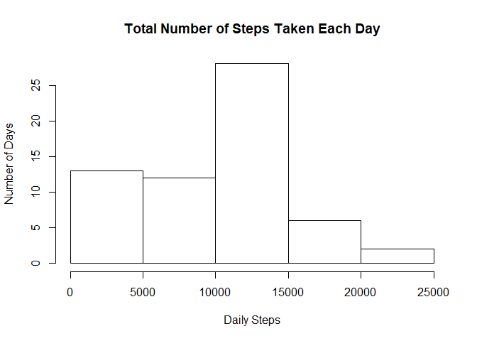
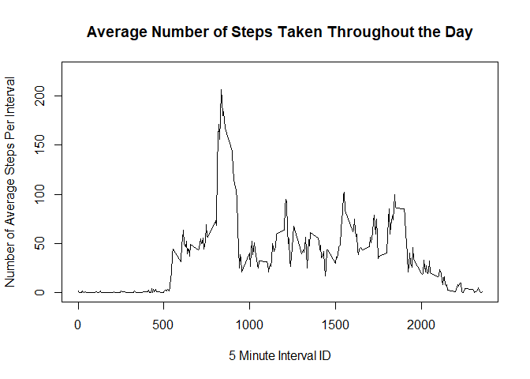
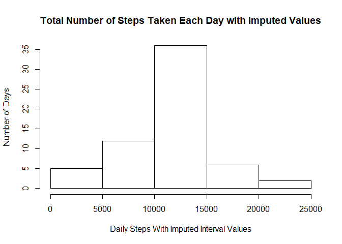
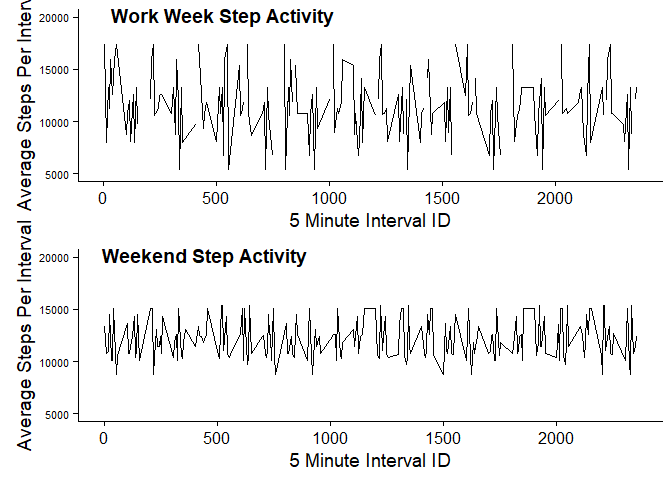

# Step Data Assignment
Helen Levy-Myers  
November 26, 2017  
This assignment analysizes daily step data of a single anonymous individual during the months of October and November 2012. The data was collected using a personal activity monitoring device, such as a Fitbit or Nike Fuelband. The data consists of the number of steps taken during a 5-minute interval, the date, and ID for each 5 minute interval. 

This assignment follows Literate Statistical Programming standards, which involve weaving human readable text and tangling it with machine readable code in the same document. Under each heading, there will be the R code, the output and some analysis. The data was downloaded on November 16, 2017 and the analysis and coding was done entirely by Helen Levy-Myers. All errors and omissions are entirely the responsiblity of Helen Levy-Myers, the author. 

##Setting up and reading in the data

```r
library(dplyr)
```

```
## 
## Attaching package: 'dplyr'
```

```
## The following objects are masked from 'package:stats':
## 
##     filter, lag
```

```
## The following objects are masked from 'package:base':
## 
##     intersect, setdiff, setequal, union
```

```r
library(ggplot2)
library(tidyverse)
```

```
## Loading tidyverse: tibble
## Loading tidyverse: tidyr
## Loading tidyverse: readr
## Loading tidyverse: purrr
```

```
## Conflicts with tidy packages ----------------------------------------------
```

```
## filter(): dplyr, stats
## lag():    dplyr, stats
```

```r
library(lubridate)
```

```
## 
## Attaching package: 'lubridate'
```

```
## The following object is masked from 'package:base':
## 
##     date
```

```r
library(cowplot)
```

```
## 
## Attaching package: 'cowplot'
```

```
## The following object is masked from 'package:ggplot2':
## 
##     ggsave
```

```r
#read Step Data
StepData <- read.csv("./activity.csv")
knitr::opts_chunk$set(echo = TRUE)
```
##Total Number of Steps Taken Daily

The assignment asked several questions about how many steps the individual took daily. Many health authorities recommend that individuals take 10,000 steps every day and the first set of questions asked to calculate the total number of steps taken daily, the mean and median (middle number) number of steps taken daily and then make a histogram of the results. Because the median is a single number in the exact middle of the daily data, it seems to often represent the person was sitting and eating lunch at noon each day which is most likely why there is not much data there.  


```r
#Calculate total number, mean and median of steps taken per day
DailySteps <- group_by(StepData, as.Date(date)) 
DailySteps <- summarize(DailySteps, eachDay = sum(steps, na.rm = TRUE), 
          eachDayMean = mean(steps, na.rm = TRUE), eachDayMedian = median(steps, na.rm = TRUE))
DailySteps
```

```
## # A tibble: 61 x 4
##    `as.Date(date)` eachDay eachDayMean eachDayMedian
##             <date>   <int>       <dbl>         <dbl>
##  1      2012-10-01       0         NaN            NA
##  2      2012-10-02     126     0.43750             0
##  3      2012-10-03   11352    39.41667             0
##  4      2012-10-04   12116    42.06944             0
##  5      2012-10-05   13294    46.15972             0
##  6      2012-10-06   15420    53.54167             0
##  7      2012-10-07   11015    38.24653             0
##  8      2012-10-08       0         NaN            NA
##  9      2012-10-09   12811    44.48264             0
## 10      2012-10-10    9900    34.37500             0
## # ... with 51 more rows
```

```r
#histogram of total steps taken each day
hist(DailySteps$eachDay, xaxt = NULL, xlab = "Daily Steps", yaxt = NULL, ylab = "Number of Days",
     main = "Total Number of Steps Taken Each Day")
```

<!-- -->

##Average Daily Activity Pattern
The assignment asked for an analysis of daily activity. Does this individual take more steps in the morning, midday, or in the evening? It seems that the person usually takes double the steps in early morning than at any other time. The highest two month average step count taken in one five minute interval is 206.17 steps during the 5 Minute Interval #835 out of the total of 2355 intervals. 

```r
#Calculate the average daily activity pattern & which 5 minute interval ID has the highest number of steps
MinuteSteps <- group_by(StepData, interval)
MinuteSteps <- summarise(MinuteSteps, StepsPerInterval = mean(steps, na.rm = TRUE))
MinuteSteps
```

```
## # A tibble: 288 x 2
##    interval StepsPerInterval
##       <int>            <dbl>
##  1        0        1.7169811
##  2        5        0.3396226
##  3       10        0.1320755
##  4       15        0.1509434
##  5       20        0.0754717
##  6       25        2.0943396
##  7       30        0.5283019
##  8       35        0.8679245
##  9       40        0.0000000
## 10       45        1.4716981
## # ... with 278 more rows
```

```r
MaxRow <- which.max(MinuteSteps$StepsPerInterval)
MinuteSteps[MaxRow, ]
```

```
## # A tibble: 1 x 2
##   interval StepsPerInterval
##      <int>            <dbl>
## 1      835         206.1698
```

```r
#Make a time series plot of the 5 minute intervals of the average number of steps across all days
plot(x = MinuteSteps$interval, y = MinuteSteps$StepsPerInterval, type = "l", ylim = c(0, 225), 
     xaxt = NULL, xlab = "5 Minute Interval ID", yaxt = NULL, ylab = "Number of Average Steps Per Interval",
     main = "Average Number of Steps Taken Throughout the Day")
```

<!-- -->

##Imputed Missing Values

The data has numerous NA values; a calculation shows it to be 2304 NA values, about 13.1%. It was decided to replace the NAs with the average interval data calculated in the previous section. A sum, mean and median for each day was calculated with the NAs replaced and a histogram was created to compare the original data with missing data and the data with imputed values. The data without NA has signficantly more days with 10,000 steps and fewer days with less steps.


```r
#Imputing missing values
#Find the number of missing values
sum(is.na(StepData$steps))
```

```
## [1] 2304
```

```r
#Take the mean for each interval calculated above and use it to replace NAs
MinuteSteps #mean calculated in previous section
NoBlankData <- StepData #create separate database for analysis
as.list(MinuteSteps)
```

```r
#Calculate sum, mean, and median for data with NAs replaced
NoBlankData1 <- NoBlankData %>% replace_na(list(steps = MinuteSteps$StepsPerInterval))
NoBlankSteps <- group_by(NoBlankData1, as.Date(date)) 
NoBlankSteps <- summarize(NoBlankSteps, NoBlankDay = sum(steps, na.rm = TRUE), 
                        NoBlankDayMean = mean(steps, na.rm = TRUE), NoBlankDayMedian = median(steps, na.rm = TRUE))
NoBlankSteps
```

```
## # A tibble: 61 x 4
##    `as.Date(date)` NoBlankDay NoBlankDayMean NoBlankDayMedian
##             <date>      <dbl>          <dbl>            <dbl>
##  1      2012-10-01   10766.19       37.38260         34.11321
##  2      2012-10-02     126.00        0.43750          0.00000
##  3      2012-10-03   11352.00       39.41667          0.00000
##  4      2012-10-04   12116.00       42.06944          0.00000
##  5      2012-10-05   13294.00       46.15972          0.00000
##  6      2012-10-06   15420.00       53.54167          0.00000
##  7      2012-10-07   11015.00       38.24653          0.00000
##  8      2012-10-08   10766.19       37.38260         34.11321
##  9      2012-10-09   12811.00       44.48264          0.00000
## 10      2012-10-10    9900.00       34.37500          0.00000
## # ... with 51 more rows
```

```r
hist(NoBlankSteps$NoBlankDay, xaxt = NULL, xlab = "Daily Steps With Imputed Interval Values", yaxt = NULL, ylab = "Number of Days",
     main = "Total Number of Steps Taken Each Day with Imputed Values")
```

<!-- -->

##Activity Patterns on Weekdays and the Weekend

Another way the assignment wanted to look at step activity patterns was between the work week, defined as Monday to Friday and the weekend, as Saturday and Sunday. The NA values were replaced using the formula in the imputed values section above. Then the data frame was separated into two dataframes, the work week and weekend. Finally the mean was calculated for the 5 minute interval id in the two separate data frames. The most significant difference is that many more steps on average are made during the work week and there is a greater range of steps made. One could make a guess that this individual walks to work or walks to a bus stop and then to a place of work. On the weekends, the individual might rest on a couch, not walking much, which is reflected in the data. 


```r
#Looking at differences between weekday and weekend activity
DayofWeek <- NoBlankSteps #create separate database with imputed missing values for analysis
DayofWeek <- transform(DayofWeek, exactDay = weekdays( `as.Date(date)`))
DayofWeek <- transform(DayofWeek, minuteinterval = StepData$interval)
DayofWeek1 <- filter(DayofWeek, exactDay == "Monday" | exactDay == "Tuesday" | exactDay == "Wednesday" | 
                             exactDay == "Thursday" | exactDay == "Friday")
DayofWeek1 <- aggregate(NoBlankDay ~ minuteinterval, subset = minuteinterval, data = DayofWeek1, mean)
DayofWeek2 <- filter(DayofWeek, exactDay == "Sunday" | exactDay == "Saturday")
DayofWeek2 <- aggregate(NoBlankDay ~ minuteinterval, subset = minuteinterval, data = DayofWeek2, mean)
       
#plot graphs showing activity on weekends versus the workweek
Workweekplot <- ggplot(data = DayofWeek1, aes(x= minuteinterval, y = NoBlankDay)) +
        geom_line() + 
        ylim(5000, 20000) +
        labs(x = "5 Minute Interval ID") +
        labs(y = "Average Steps Per Interval") +
        theme(axis.text.y = element_text(size = 8)) +
        labs(main = "Average Number of Steps Taken (Work Week)")

Weekendplot <- ggplot(data = DayofWeek2, aes(x= minuteinterval, y = NoBlankDay)) +
        geom_line() +
        ylim(5000, 20000) +
        labs(x = "5 Minute Interval ID") +
        labs(y = "Average Steps Per Interval") +
        theme(axis.text.y = element_text(size = 8)) +
        labs(main = "Average Number of Steps(Weekend)")

plot_grid(Workweekplot, Weekendplot, labels = c("Work Week Step Activity", "Weekend Step Activity"), nrow = 2)
```

<!-- -->
